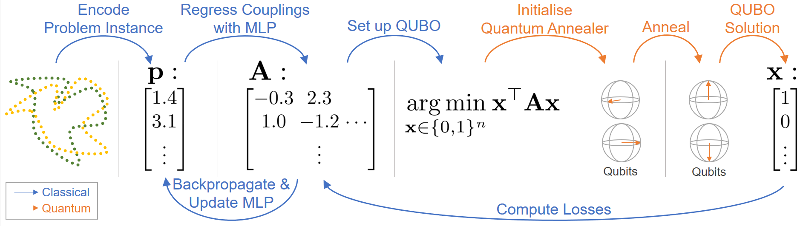

# QuAnt: Quantum Annealing with Learnt Couplings (ICLR 2023)
[Marcel Seelbach Benkner<sup>1</sup>](https://www.vsa.informatik.uni-siegen.de/en/seelbach-marcel), [Maximilian Krahn<sup>2,3</sup>](https://scholar.google.com/citations?user=Dg5q7-QAAAAJ&hl=de), [Edith Tretschk<sup>2</sup>](https://people.mpi-inf.mpg.de/~tretschk/), [Zorah Lähner<sup>1</sup>](https://zorah.github.io/), [Michael Möller<sup>1</sup>](https://sites.google.com/site/michaelmoellermath/), and [Vladislav Golyanik<sup>2</sup>](https://people.mpi-inf.mpg.de/~golyanik/)

 <sup> 1 </sup> University of Siegen , <sup>2</sup>Max Planck Institute for Informatics, <sup>3</sup> Aalto University.

This is the official repository for the project "QuAnt: Quantum Annealing with Learnt Couplings".
In this work the coupling matrices for a quantum annealer are learnt with a neural network.
The preprint can be found at https://arxiv.org/abs/2210.08114 and the project page is at https://4dqv.mpi-inf.mpg.de/QuAnt/.
The code can be executed with [PyTorch](https://pytorch.org/) and the [D-Wave ocean sdk](https://docs.ocean.dwavesys.com/en/stable/). 
To run the code without a quantum annealer on can use [D-Wave neal](https://docs.ocean.dwavesys.com/projects/neal/en/latest/) instead of a QPU Sampler or look a the experiments with exhaustive search mostly in point_set_registration and rotation_estimation.




[](https://arxiv.org/abs/2210.08114)


## Getting Started
-The repository can be cloned with <br/>
`git clone https://github.com/MSeelbach/QuAnt/` <br/>
-We recommend the user to set up a conda environment
```
conda create --name QuAnt-env
conda activate QuAnt-env
```
-The [D-Wave ocean sdk](https://docs.ocean.dwavesys.com/en/stable/) can be installed with
`pip install dwave-ocean-sdk` <br/>
-Installing [PyTorch](https://pytorch.org/) is another prerequisite.


### Graph Matching
Install numpy, the [D-Wave ocean sdk](https://docs.ocean.dwavesys.com/en/stable/) and [PyTorch](https://pytorch.org/).
Execute the `PermutationLearningPegasus.py` file to start the training. This can be done in the console without futher arguments as <br/>
´python PermutationLearningPegasus.py´ <br/>
You can train the smaller network 
by setting _UseDeeperNetwork_ to false at line 41 of the `PermutationLearningPegasus.py` file. To train on Willow set _TrainOnWillow_ to true.
In the same way you have to set _UseQuantumAnnealer_ to true to use quantum annealing instead of simulated annealing.

### General Comments for point set registration and rotation estimation
In both setups it is necessary to download the datasets seperatly. The point set registration dataset can be found [here](https://2dshapesstructure.github.io) and the ModelNet10 dataset [here](https://modelnet.cs.princeton.edu). In both setups it is necessary to adapt the file paths to the local versions of the datasets and also work-directories.

### Point Set Registration
Install numpy, glob, scipy, icp, the [D-Wave ocean sdk](https://docs.ocean.dwavesys.com/en/stable/) and [PyTorch](https://pytorch.org/).
Then in the first step the data gets generated. This is done by executing the `point_set_reg_data_gen.py` file. This file needs to run 16 times as follows:
```
$python point_set_reg_data_gen.py 1
$python point_set_reg_data_gen.py 2
...
$python point_set_reg_data_gen.py 16
```

This allows the code to generate 16 different dataframes for training as well as one test dataframe.

Afterwards it is possible to execute the training files without any further inputs. They can be found in the folders `diag_baseline`, `pure_baseline` and in `QuAnt_baseline`. All folders contain 4 files for the 4 network sizes demonstrated in the paper. the file file with the ending `_3.py` contains the model setup with 3 layers and the width of 32, the files with the ending of  `_3_2.py` have the model setup of 3 layers and a width of 78. The 5 files containing the 5 layered models are named analogously with `_5.py` and `_5_2.py` respectively.

All files will save an histogram about the error rate of the evaluation dataset. In the paper we reported the mean and std over multiple runs of this histogram.

### Rotation Estimation

For the rotation estimation experiments there is no data preprocessing in a seperated step needed, as all is included in the main experimental files.
Here we have the three folders, `diag_baseline`, `pure_baseline` and `QuAnt_baseline`, which contain the corresponding setups. Each folder contains 4 folders named `3_1` (setup with 3 layers and width of 32), `3_2` (setup with 3 layers and width of 78), `5_1` (setup with 5 layers and width of 32), `5_2` (setup with 5 layers and width of 78).
As we explained in the paper for the rotation estimation case 3 networks are needed to fully regress the 3D rotation. 
Those three can be found in each folder. In order to train the three models all three files (`3d_*`) need to be executed. Once the models are trained and the weights are saved the file `quantumml3d_mixed_eval.py` will test the model and print the mean error of it. 


## License
Shield: [![CC BY-NC-SA 4.0][cc-by-nc-sa-shield]][cc-by-nc-sa]

This work is licensed under a
[Creative Commons Attribution-NonCommercial-ShareAlike 4.0 International License][cc-by-nc-sa].

[![CC BY-NC-SA 4.0][cc-by-nc-sa-image]][cc-by-nc-sa]

[cc-by-nc-sa]: http://creativecommons.org/licenses/by-nc-sa/4.0/
[cc-by-nc-sa-image]: https://licensebuttons.net/l/by-nc-sa/4.0/88x31.png
[cc-by-nc-sa-shield]: https://img.shields.io/badge/License-CC%20BY--NC--SA%204.0-lightgrey.svg